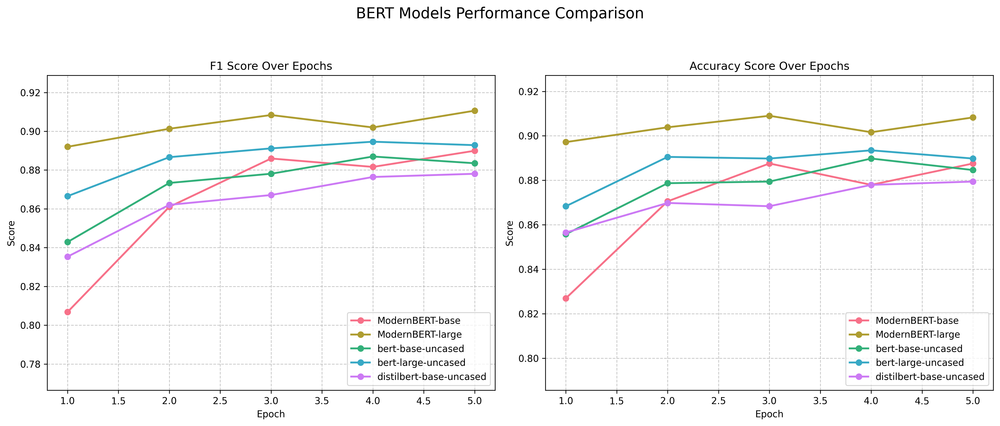
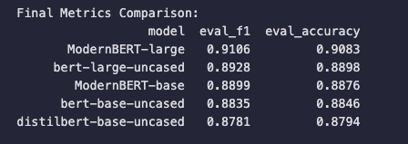

# Fine-Tuning Models for Sentiment Analysis of Electrical Device Feedback

## Overview

This repository focuses on automating text classification for electrical device feedback. We will use a synthetically generated [Electrical Device Feedback dataset](https://huggingface.co/datasets/disham993/ElectricalDeviceFeedbackBalanced) for fine-tuning BERT family models, including the latest ModernBERT model. The dataset was balanced using Neutral and Mixed sentiment data points generated via prompt engineering and Llama 3.1:8b via the Ollama library. The project enables efficient feedback classification, streamlining tasks like sentiment analysis, product improvement, and customer insights.

---

## Features

- **Synthetic Dataset Generation**: Utilizes synthetic data generation to balance sentiment classes.
- **Fine-Tuning Pipeline**: Implements a complete pipeline for fine-tuning models like BERT and ModernBERT.
- **Model Evaluation**: Includes detailed metrics like precision, recall, F1, and accuracy.
- **Hugging Face Integration**: Pushes fine-tuned models to the Hugging Face Hub with detailed model cards.

---

## Project Structure

```
├── data/                            # Contains tokenized datasets and raw data
│   └── additional_feedback.csv      # Additional data points for balancing classes
├── logs/                            # Training and evaluation logs
├── models/                          # Fine-tuned models
├── notebooks/                       # Jupyter notebooks for various stages of the pipeline
│   ├── 01_data_preprocessing.ipynb  # Preprocessing the dataset
│   ├── 02_data_tokenization.ipynb   # Tokenizing and preparing the dataset
│   ├── 03_model_building.ipynb      # Fine-tuning transformer models
│   ├── 04_model_evaluation.ipynb    # Evaluating model performance
│   ├── 05_model_upload.ipynb        # Pushing models and cards to Hugging Face Hub
│   └── 06_model_inference.ipynb     # Performing inference on unseen data
├── prompts/                         # Prompt engineering scripts
│   ├── __init__.py                  # Initialize prompts as a package
│   └── prompts.py                   # Prompt templates and generation scripts
├── utilities/                       # Helper scripts and constants
│   ├── __init__.py                  # Initialize utilities as a package
│   ├── constants.py                 # Configuration and constants
│   └── helper.py                    # Utility functions for Hugging Face integration
├── generate_additional_data.py      # Script for generating additional dataset points
├── .env                             # Environment variables for Hugging Face token
└── README.md                        # Project documentation (this file)
```

---

## Getting Started

### Prerequisites

- Python 3.10+
- Create conda environment:
   ```bash
   conda create -n feedback_classifier python=3.11
   conda activate feedback_classifier
   ```
- Install required libraries:
   ```bash
   pip install -r requirements.txt
   ```

- Hugging Face Token:
  - Create an account on [Hugging Face](https://huggingface.co/).
  - Generate a personal access token from your account settings.

### Setting Up Environment

- Add the Hugging Face token to a `.env` file:

```env
HF_TOKEN=your_hugging_face_token
```

- Ensure the repository is structured as described above.

### Running the Pipeline

1. **Dataset Preparation**:

   - Run `01_data_preprocessing.ipynb` to preprocess the dataset. 

2. **Data Tokenization**:

   - Execute `02_data_tokenization.ipynb` to tokenize and prepare the dataset.

3. **Model Training**:

   - Execute `03_model_building.ipynb` to fine-tune models on the dataset.

4. **Model Evaluation**:

   - Use `04_model_evaluation.ipynb` to evaluate model performance.

5. **Model Upload to Hugging Face Hub**:

   - Use `05_model_upload.ipynb` to push models and model cards to the Hugging Face Hub.

6. **Model Inference**:

   - Use `06_model_inference.ipynb` to test fine-tuned models both that are stored locally and also the models that are pushed to the hub on unseen data.

---

## Results and Evaluation

**Evaluation Metric Plots**



**Final Metrics Comparison**



Medium article in progress . . . 

## How to Use the Models

### Inference Example

After deploying a model to the Hugging Face Hub, use the following code snippet for inference:

```python
from transformers import AutoTokenizer, AutoModelForSequenceClassification, pipeline

model_name = "disham993/electrical-classification-ModernBERT-large"
tokenizer = AutoTokenizer.from_pretrained(model_name)
model = AutoModelForSequenceClassification.from_pretrained(model_name)
nlp = pipeline("text-classification", model=model, tokenizer=tokenizer)

text = "The new washing machine is efficient but produces a bit of noise."
classification_results = nlp(text)
print(classification_results)
```

---

## Available Models

The following models are fine-tuned and available on the Hugging Face Hub:

| Model            | Repository                                                                  | Description                      |
| ---------------- | --------------------------------------------------------------------------- | -------------------------------- |
| BERT Base        | [Link](https://huggingface.co/disham993/electrical-classification-bert-base)       | Lightweight model for classification. |
| BERT Large       | [Link](https://huggingface.co/disham993/electrical-classification-bert-large)      | High-accuracy model for classification. |
| DistilBERT Base  | [Link](https://huggingface.co/disham993/electrical-classification-distilbert-base) | Efficient model for quick tasks. |
| ModernBERT Base  | [Link](https://huggingface.co/disham993/electrical-classification-ModernBERT-base) | Advanced base model.             |
| ModernBERT Large | [Link](https://huggingface.co/disham993/electrical-classification-ModernBERT-large)| High-performance classification model. |

---

## Contributing

Contributions are welcome! To contribute:

1. Fork the repository.
2. Create a new branch (`git checkout -b feature-name`).
3. Commit your changes (`git commit -m 'Add feature'`).
4. Push to the branch (`git push origin feature-name`).
5. Open a pull request.

---

## License

This project is licensed under the MIT License. See the LICENSE file for details.

---

## Contact

For questions or suggestions, feel free to reach out:

- **Name**: Isham Rashik
- **Email**: d.isham.993@gmail.com
- **Hugging Face Profile**: [disham993](https://huggingface.co/disham993)

Let’s revolutionize electrical device feedback analysis with state-of-the-art NLP! 🔌